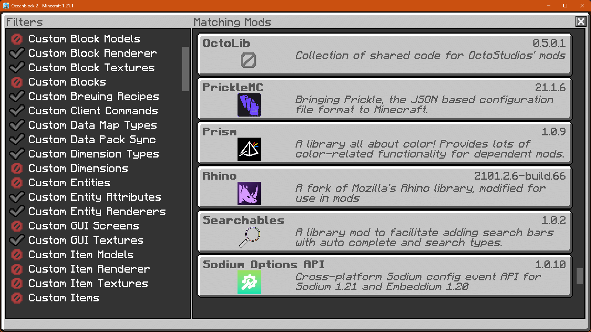
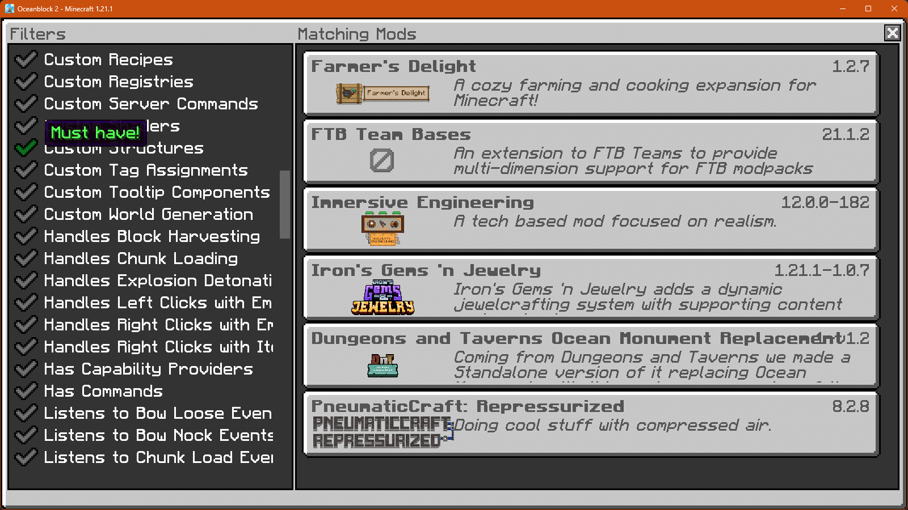
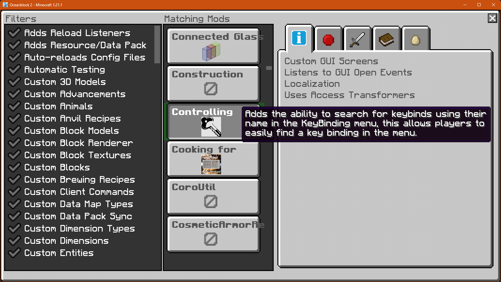
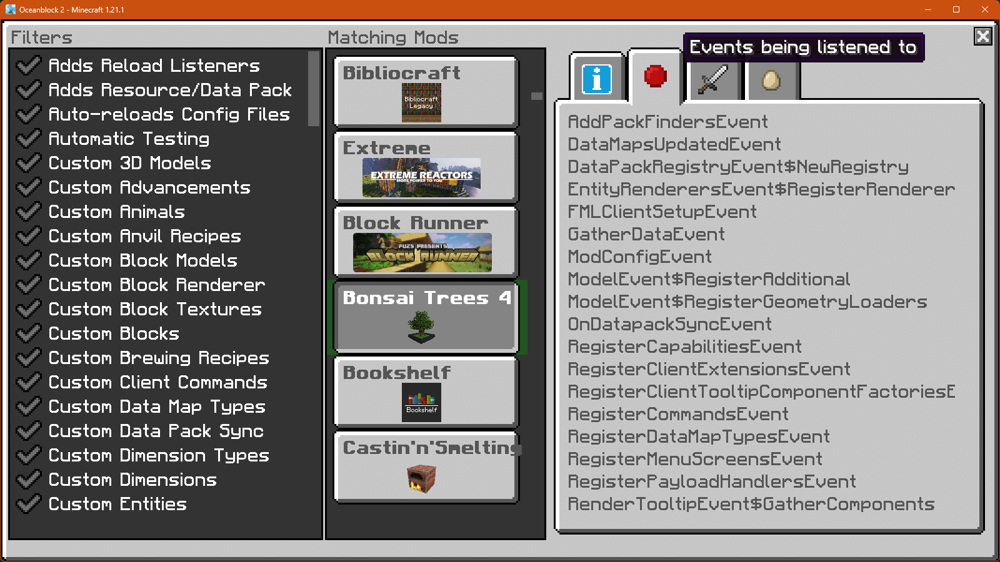

# Who Does That

A Minecraft Mod Analysis ~~Tool~~Mod. Preview Edition.

Generates a "what does it do" report of all installed mods and their contents.

These reports are first and foremost machine-readable, but there is also a viewer integrated
into the mod that allows for easy browsing and filtering of the reports.

This mod is client-side only and does not require any server-side components.
There will be a gametest ready server-side integration in the future, which means that these
reports can be generated automatically using a CI system.

Example outputs can be found in the [examples](./docs/example-output) directory.

Screenshots of the viewer can be found at the end of this document.

## How does it do that?

The reports are solely based on the data gathered during the mod loading process.
This means that the report is generated without actually loading any of the mods classes or
resources. While being good for performance this mainly reduces the chance for arbitrary crashes
and unwanted code execution.

It also means that we can't do all the things we could do if we were to load the classes, like
checking for reflection or usage of Event-less registration systems.

This means we might miss crucial things that a mod does.

These reports must always be taken with a grain of salt and should not be the only source of
information when deciding if a mod is responsible for some feature or not.

## When does the mod generate the reports?

When the game starts up without any reports present, the mod will automatically generate the reports
and save them to disk. Only if there is a newer mod installed or the reports are deleted will the
mod regenerate the reports.

You can also manually trigger the generation of the reports in the mod settings.

## How can I view the reports in game?

Sorry, there will be a better way in the future. You have to open the "Mods" screen and open the
config screen of Who Does That. There you can find a button to open the viewer. When you are
already in game, you can also use the `/whodoesthat show` command.

## Can I add my own sources?

Yes, you can to some extent. Read the [Configuration](./docs/Configuration.md) documentation for
more information on how to do that.

## State of the project

This project is still in a very early stage and is missing a lot of experience on how to best
gather and report some of the results. Please consider this beta software.

## Screenshots

